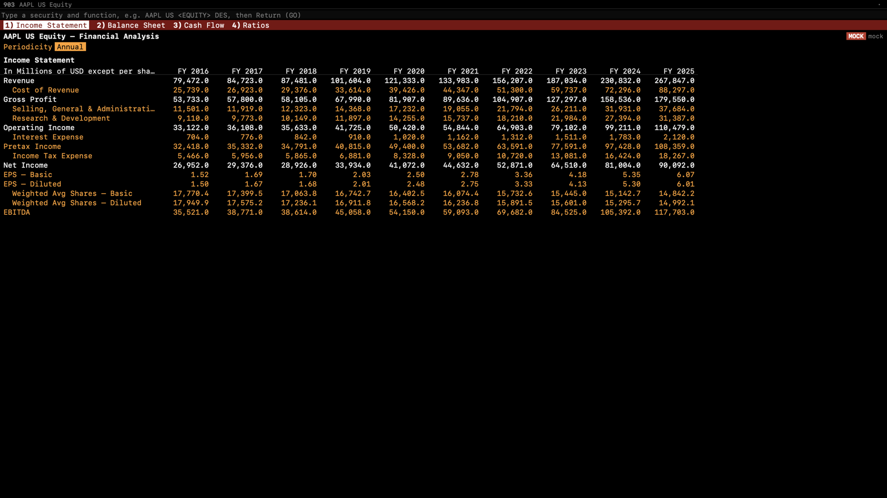

<p align="center"></p>

<h1 align="center">Meridian</h1>

<p align="center">A native macOS market terminal driven entirely from a command line.</p>

Type a security and a function mnemonic, press GO, and the screen opens in one of four linked panels: `AAPL US <EQUITY> GP <GO>`. More than thirty functions cover live quote monitors and watchlists, candlestick charts with studies, historical prices, company descriptions, as-reported financials, SEC filings with an AI summary and a diff between versions, analyst ratings, news, option chains valued with Black–Scholes and binomial models, a screener, correlation and portfolio analytics, a backtester, alerts, an economic calendar, the Treasury curve, FX crosses and crypto.

Meridian runs on real data only. Every screen shows where its data came from and how delayed it is, and anything no configured source provides says `NOT AVAILABLE` with the reason instead of being filled in.


<sub>Screenshots are rendered with the synthetic feed used by the test suite and labeled MOCK DATA, so no licensed market data is republished here. The app itself never shows synthetic data.</sub>

| | |
|---|---|
|  |  |

## Functions

| Area | Mnemonics |
|---|---|
| Equities | `DES` description · `GP` / `GIP` price graphs · `HP` historical prices · `FA` financials · `EE` estimates · `ERN` earnings · `ANR` analyst ratings · `HDS` holders · `DVD` dividends |
| Monitors | `W` worksheet · `MOST` most active · `WEI` world indices (labeled ETF proxies on free sources) · `CRYP` crypto · `FXC` FX crosses · Launchpad monitor (`BLP`) |
| News and filings | `TOP` · `N` · `CN` · `CF` filings with AI summary and version diff |
| Derivatives | `OMON` option monitor · `OVDV` volatility surface · `OVME` option valuation |
| Analytics | `EQS` screener · `RV` relative value · `CORR` correlation · `PORT` portfolio · `BTST` backtester · `ALRT` alerts |
| Macro | `ECO` economic calendar and series · Treasury curve |
| AI | `ASK` analyst built on Claude, answering from the terminal's own data through tools |
| Navigation | `SECF` security finder · `MENU` · `HELP` syntax, keys and function directory · F-key sectors · linked panels |

`docs/FUNCTIONS.md` lists every mnemonic, its status, and what it needs.

## Data sources

All free and official. Keys are stored only in the macOS Keychain and entered in **Settings → Setup**.

| Source | Provides | Needs |
|---|---|---|
| [Alpaca](https://alpaca.markets) | US equity quotes (IEX on the free plan), streaming, bars, news, option chains, corporate actions (dividend and split dates) | Free key |
| [SEC EDGAR](https://www.sec.gov/about/developer-resources) | Company search, as-reported financials, dividends per share by fiscal period, filings | Your name and email (SEC fair-access policy) |
| [FRED](https://fred.stlouisfed.org/docs/api/api_key.html) | Economic series and release calendar | Free key |
| [Finnhub](https://finnhub.io) | Market and company news, analyst ratings, earnings | Free key |
| Coinbase, Kraken | Crypto quotes and streaming | Nothing |
| ECB via Frankfurter | FX reference rates | Nothing |
| U.S. Treasury | Par yield curve | Nothing |
| GlobeNewswire, PR Newswire, Business Wire | Press releases | Nothing |
| [Anthropic](https://platform.claude.com/docs/en/get-api-key) | `ASK` and filing summaries | Key (billed per use) |

`docs/DATA_PROVIDERS.md` compares paid alternatives (consolidated SIP equities, OPRA options, estimates) with cited pricing.

## Architecture

SwiftUI and AppKit over a Rust core (21 crates, bridged with UniFFI), with DuckDB for time series and SQLite for app state. One `Provider` trait sits under every source, with capability routing, retries, circuit breakers and token-bucket rate limits. Quotes cross into Swift as packed 128-byte rows polled once per frame; charts decimate per pixel column, so work per frame is bounded by width, not series length. See [`ARCHITECTURE.md`](ARCHITECTURE.md).

Measured on an M5 Pro, release build (`scripts/perf-app.sh`, results in `bench/results/`):

| Budget | Result |
|---|---|
| Cold launch < 1.5 s | 0.17–0.66 s |
| Command suggestions < 50 ms | < 0.1 ms |
| 2,000 streaming symbols, 60 fps, < 10% CPU | 60 fps at 7.2–9.7% of one core |
| 1M-bar chart pan/zoom at 60 fps | p99 8–9 ms per frame |

## Building

Requires macOS 15+, Xcode 27 (Swift 6.4), Rust (stable, edition 2024) and [XcodeGen](https://github.com/yonaskolb/XcodeGen).

```bash
scripts/build-app.sh release        # fonts, Rust core + bindings, Xcode project, app
scripts/install-app.sh --dock       # copy to ~/Applications and pin to the Dock
```

Signing uses an Apple Development identity: set `DEVELOPMENT_TEAM` in `app/project.yml` to your own team ID. Tests:

```bash
cargo test --manifest-path core/Cargo.toml --workspace
xcodebuild -project app/Meridian.xcodeproj -scheme Meridian -destination 'platform=macOS,arch=arm64' test
```

## Notes

Built for personal use. It does not redistribute market data, and each provider's terms apply to what you fetch with your own keys. Not affiliated with any market-data or terminal vendor.
