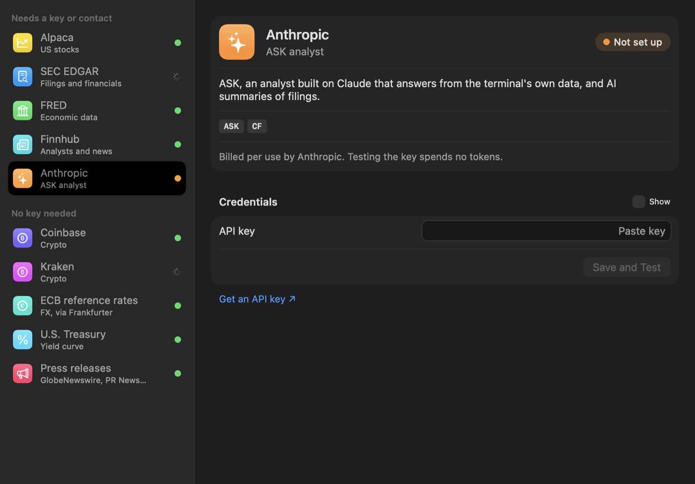
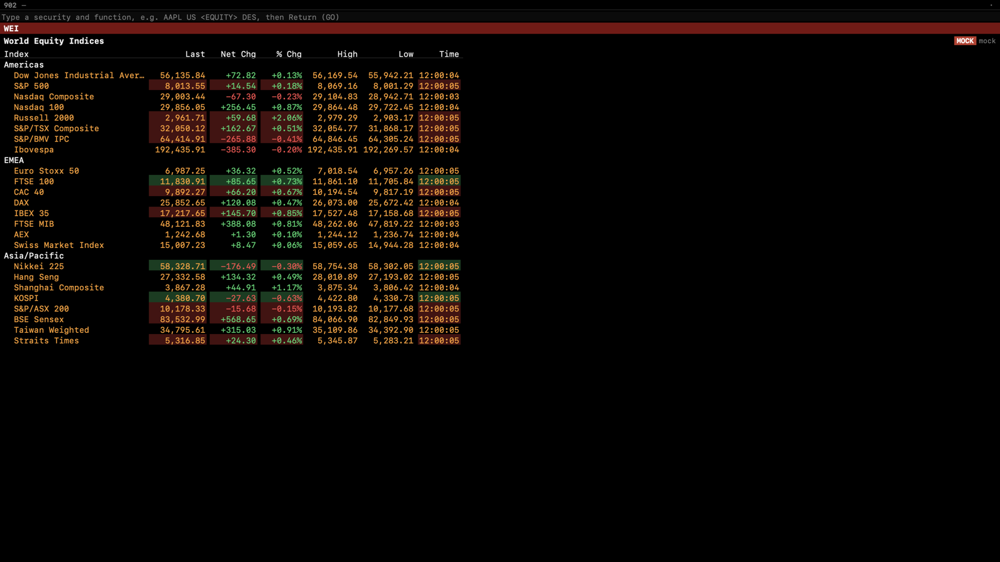

<p align="center"></p>

<h1 align="center">Meridian</h1>

<p align="center">A native macOS market terminal driven entirely from a command line.</p>

<p align="center">
  <a href="https://github.com/ankthba/meridian/releases/latest"></a>
  <a href="https://github.com/ankthba/meridian/actions/workflows/ci.yml"></a>
  
</p>

Type a security and a function mnemonic, press GO, and the screen opens in one of four linked panels: `AAPL US <EQUITY> GP <GO>`. Thirty-three functions cover live quote monitors and watchlists, candlestick charts with studies, historical prices, company descriptions, as-reported financials, SEC filings with an AI summary and a diff between versions, dividends and splits, analyst ratings, news, option chains valued with Black–Scholes and binomial models, a screener, correlation and portfolio analytics, a backtester, alerts, an economic calendar, the Treasury curve, world indices, FX crosses and crypto.

Meridian runs on real data only, from free official sources. Every screen shows where its data came from and how delayed it is, and anything no connected source provides says `NOT AVAILABLE` with the reason instead of being filled in.


<sub>Terminal screenshots use the synthetic feed from the test suite and are labeled MOCK DATA, so no licensed market data is republished here. The app itself never shows synthetic data.</sub>

| | |
|---|---|
|  |  |
|  |  |

## Download

Get **Meridian-1.0.0.zip** from the [latest release](https://github.com/ankthba/meridian/releases/latest), unzip it, and move Meridian to Applications. The app is signed but not notarized, so macOS blocks the first launch: open it once, then go to **System Settings → Privacy & Security** and click **Open Anyway**. Requires macOS 15 or later on Apple silicon.

On first launch, Settings opens on **Data Sources**. Add the free keys you want; each source has a **Save and Test** button that connects it immediately and makes one real request so you can see it works. The [user guide](docs/GUIDE.md) walks through each source, the command syntax and every function.

## Functions

| Area | Mnemonics |
|---|---|
| Equities | `DES` description · `GP` / `GIP` price graphs · `HP` historical prices · `FA` financials · `ERN` earnings · `ANR` analyst ratings · `DVD` dividends and splits · `EE` estimates · `HDS` holders |
| Monitors | `W` worksheet · `MOST` most active · `WEI` world indices · `CRYP` crypto · `FXC` FX crosses · Launchpad (`BLP`) |
| News and filings | `TOP` · `N` · `CN` · `CF` filings with AI summary and version diff |
| Derivatives | `OMON` option monitor · `OVDV` volatility surface · `OVME` option valuation |
| Analytics | `EQS` screener · `RV` relative value · `CORR` correlation · `PORT` portfolio · `BTST` backtester · `ALRT` alerts |
| Macro | `ECO` economic calendar, series and the Treasury curve |
| AI | `ASK` analyst built on Claude, answering from the terminal's own data through tools |
| Navigation | `SECF` security finder · `MENU` · `HELP` syntax, keys and function directory · F-key sectors · linked panels |

`EE` and `HDS` say NOT AVAILABLE: no free source provides consensus estimates or holders. `WEI` shows labeled US-listed ETF proxies, since index levels aren't free. [`docs/FUNCTIONS.md`](docs/FUNCTIONS.md) lists every mnemonic, its status and what it needs.

## Data sources

All free and official. Keys are stored only in the macOS Keychain.

| Source | Provides | Needs |
|---|---|---|
| [Alpaca](https://alpaca.markets) | US equity quotes and streaming (IEX on the free plan), bars, news, corporate actions (dividend and split dates), option chains | Free key |
| [SEC EDGAR](https://www.sec.gov/about/developer-resources) | Company search, as-reported financials, dividends per share by fiscal period, filings | Your name and email (SEC fair-access policy) |
| [FRED](https://fred.stlouisfed.org/docs/api/api_key.html) | Economic series and release calendar | Free key |
| [Finnhub](https://finnhub.io) | Market and company news, analyst ratings, earnings | Free key |
| Coinbase, Kraken | Crypto quotes and streaming | Nothing |
| ECB via Frankfurter | FX reference rates | Nothing |
| U.S. Treasury | Par yield curve | Nothing |
| GlobeNewswire, PR Newswire, Business Wire | Press releases | Nothing |
| [Anthropic](https://platform.claude.com/docs/en/get-api-key) | `ASK` and filing summaries | Key (billed per use) |

[`docs/DATA_PROVIDERS.md`](docs/DATA_PROVIDERS.md) compares paid alternatives (consolidated SIP equities, OPRA options, estimates) with cited pricing.

## Architecture

SwiftUI and AppKit over a Rust core (21 crates, about 56,000 lines, bridged with UniFFI), with DuckDB for time series and SQLite for app state. One `Provider` trait sits under every source, with capability routing, retries, circuit breakers and token-bucket rate limits; the set of sources can be swapped while the app runs. Quotes cross into Swift as packed 128-byte rows polled once per frame, and charts decimate per pixel column, so work per frame is bounded by width rather than series length. See [`ARCHITECTURE.md`](ARCHITECTURE.md).

Measured on an M5 Pro, release build (`scripts/perf-app.sh`, results in `bench/results/`):

| Budget | Result |
|---|---|
| Cold launch < 1.5 s | 0.17–0.69 s |
| Command suggestions < 50 ms | < 0.1 ms |
| 2,000 streaming symbols, 60 fps, < 10% CPU | 60 fps; median 8.6% of one core (7.2–11.5% over seven runs) |
| 1M-bar chart pan/zoom at 60 fps | p99 7–9 ms per frame |

## Building

Requires macOS 15+, Xcode 27 (Swift 6.4), Rust 1.93 and [XcodeGen](https://github.com/yonaskolb/XcodeGen).

```bash
scripts/build-app.sh release        # fonts, Rust core + bindings, Xcode project, app
scripts/install-app.sh --dock       # copy to ~/Applications and pin to the Dock
```

Signing uses an Apple Development identity: set `DEVELOPMENT_TEAM` in `app/project.yml` to your own team ID. Tests:

```bash
cargo test --manifest-path core/Cargo.toml --workspace
xcodebuild -project app/Meridian.xcodeproj -scheme Meridian -destination 'platform=macOS,arch=arm64' test
```

## Notes

- [User guide](docs/GUIDE.md) · [Changelog](CHANGELOG.md) · [Function registry](docs/FUNCTIONS.md)
- Built for personal use. Meridian doesn't redistribute market data, and each provider's terms apply to what you fetch with your own keys. Not affiliated with any market-data or terminal vendor.
- Copyright © 2026 Aniketh Bandlamudi. All rights reserved; no license is granted to reuse the code.
