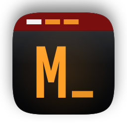
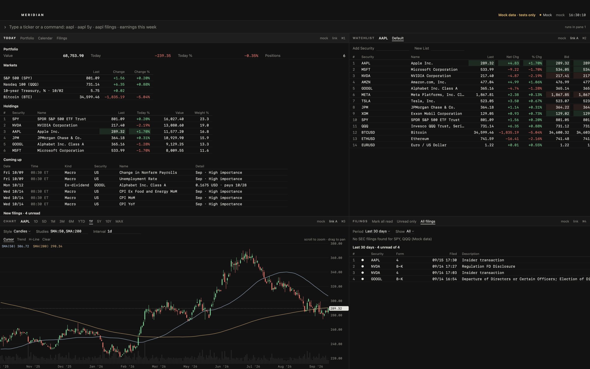
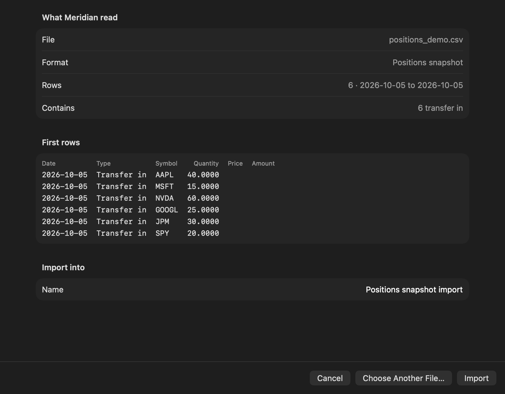
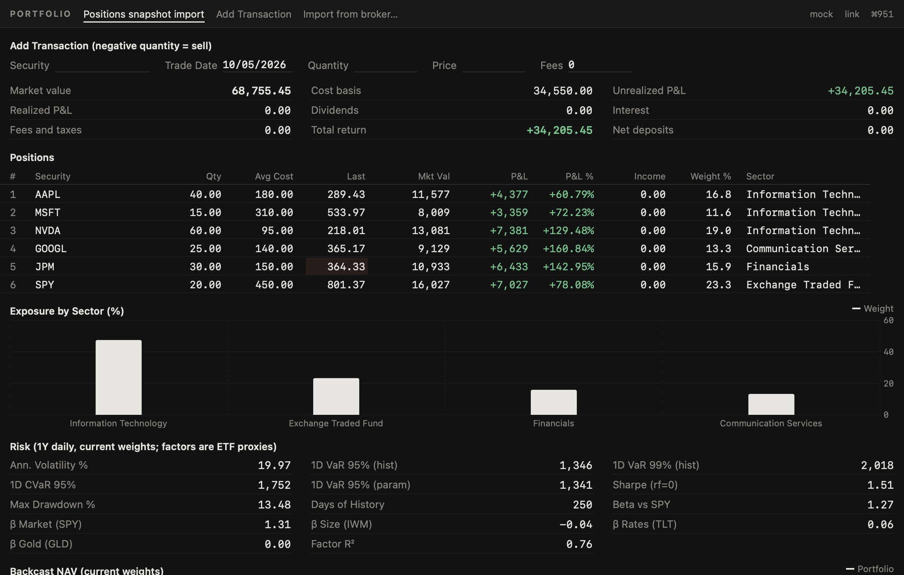
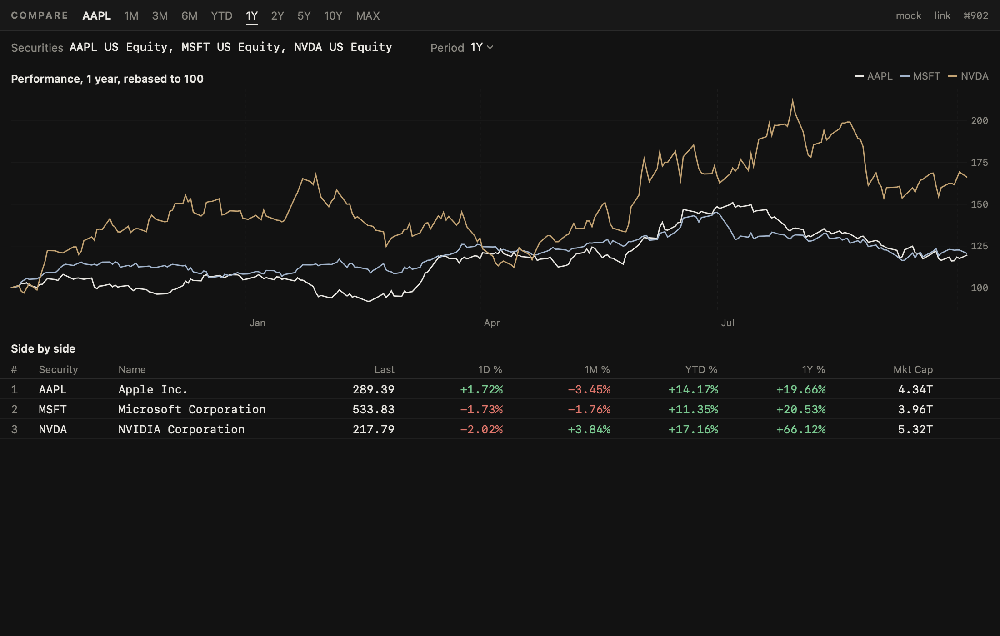
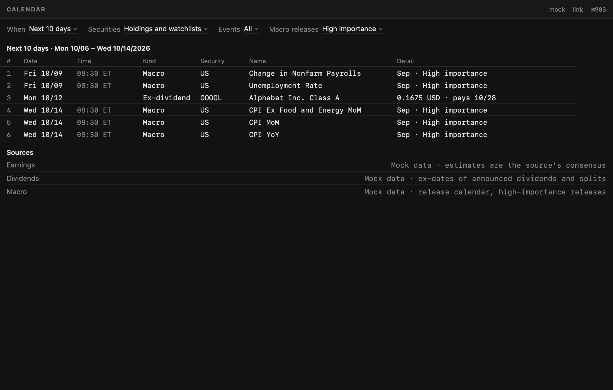
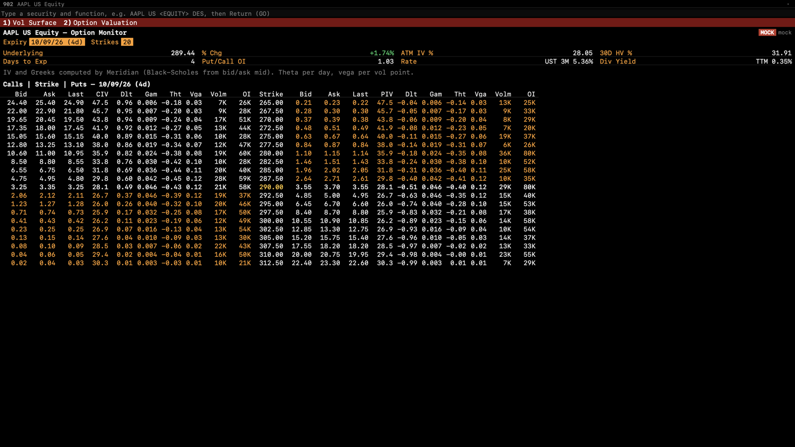
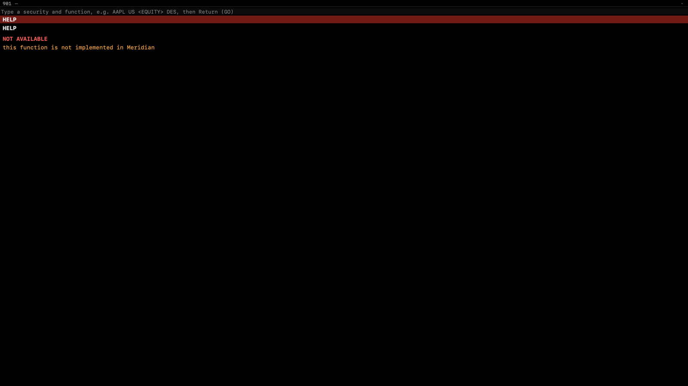

<p align="center"></p>

<h1 align="center">Meridian</h1>

<p align="center">A fast, native market terminal for the Mac. Type what you want; get real data, with its source on every screen.</p>

<p align="center">
  <a href="https://github.com/ankthba/meridian/releases/latest"></a>
  <a href="https://github.com/ankthba/meridian/actions/workflows/ci.yml"></a>
  
</p>



<sub>Screenshots use the synthetic feed from the test suite, so no licensed market data is republished here. The app itself runs on real data only.</sub>

Meridian opens on **Today**: what your portfolio did, how the market moved, what's coming up for the companies you own (earnings, ex-dividend dates, economic releases) and which of them filed with the SEC since you last looked. From there you type, in plain words:

```
aapl                    overview
aapl 5y                 five-year chart
aapl filings            SEC filings
aapl vs msft vs nvda    side by side
earnings this week      calendar
cpi · rates             macro and the yield curve
nvda options            option chain with Greeks
ask why did nvda fall   the AI analyst
```

Why use it:

- **Your real portfolio, without linking an account.** Import the CSV your broker already gives you (Robinhood, Fidelity, Schwab, Vanguard, or any file once you map its columns). Meridian shows what it read and what it skipped before saving anything, and the file never leaves your Mac.
- **Filings worth reading.** New 10-Ks, 10-Qs, 8-Ks and insider filings from what you hold arrive in an inbox, with an AI summary and a diff against the previous filing.
- **Honest data.** Every pane says where its numbers came from and how delayed they are. When no connected source has something, the screen says so and why, rather than showing a guess.
- **Free.** Everything works with free keys from official sources: SEC EDGAR, FRED, the U.S. Treasury, Alpaca, Finnhub, Coinbase and Kraken.
- **Fast and native.** SwiftUI and AppKit over a Rust core: it launches in under a second and streams 2,000 symbols at 60 fps.

| | |
|---|---|
|  |  |
|  |  |
|  |  |

## Download

Get **Meridian-1.1.0.zip** from the [latest release](https://github.com/ankthba/meridian/releases/latest), unzip it, and move Meridian to Applications. The app is signed but not notarized, so macOS blocks the first launch: open it once, then go to **System Settings → Privacy & Security** and click **Open Anyway**. Requires macOS 15 or later on Apple silicon.

On first launch, Settings opens on **Data Sources**. Add the free keys you want; **Save and Test** connects each source immediately and makes one real request so you can see it works. Then type `import` to bring in your portfolio. The [user guide](docs/GUIDE.md) covers each source, the commands and every screen.

## Screens

Thirty-seven screens. Pane headers use plain names; the classic terminal mnemonics (`AAPL US <EQUITY> GP <GO>`) still work for people who know them.

| Area | Screens |
|---|---|
| Home | Today · Calendar (earnings, dividends, splits, macro) · Filings inbox · Portfolio with broker import |
| Equities | Overview (`DES`) · Chart (`GP`, `GIP`) with candles and studies · Prices (`HP`) · Financials (`FA`) · Earnings (`ERN`) · Analysts (`ANR`) · Dividends (`DVD`) · Compare |
| Markets | Watchlists (`W`) · Most active (`MOST`) · World indices (`WEI`) · Crypto (`CRYP`) · Currencies (`FXC`) · Launchpad |
| News and filings | Headlines (`TOP`, `N`) · Company news (`CN`) · Filing reader (`CF`) with AI summary and version diff |
| Options | Chain with IV and Greeks (`OMON`) · Volatility surface (`OVDV`) · Valuation, Black–Scholes and binomial (`OVME`) |
| Analytics | Screener (`EQS`) · Peers (`RV`) · Correlation (`CORR`) · Backtester (`BTST`) · Alerts (`ALRT`) |
| Macro | Economic calendar, FRED series and the Treasury curve (`ECO`) |
| AI | Ask: an analyst built on Claude that answers from Meridian's own data and flags any number it can't trace |

Estimates (`EE`) and holders (`HDS`) say not available: no free source provides them. World indices are shown through labeled US-listed ETFs, since index levels aren't free. [`docs/FUNCTIONS.md`](docs/FUNCTIONS.md) lists every screen, its status and what it needs.

## Data sources

All free and official. Keys are stored only in the macOS Keychain.

| Source | Provides | Needs |
|---|---|---|
| [Alpaca](https://alpaca.markets) | US equity quotes and streaming (IEX on the free plan), bars, news, corporate actions (dividend and split dates), option chains | Free key |
| [SEC EDGAR](https://www.sec.gov/about/developer-resources) | Company search, as-reported financials, dividends per share by fiscal period, filings | Your name and email (SEC fair-access policy) |
| [FRED](https://fred.stlouisfed.org/docs/api/api_key.html) | Economic series and release calendar | Free key |
| [Finnhub](https://finnhub.io) | Market and company news, analyst ratings, earnings history and calendar | Free key |
| Coinbase, Kraken | Crypto quotes and streaming | Nothing |
| ECB via Frankfurter | FX reference rates | Nothing |
| U.S. Treasury | Par yield curve | Nothing |
| GlobeNewswire, PR Newswire, Business Wire | Press releases | Nothing |
| [Anthropic](https://platform.claude.com/docs/en/get-api-key) | `ASK` and filing summaries | Key (billed per use) |

[`docs/DATA_PROVIDERS.md`](docs/DATA_PROVIDERS.md) compares paid alternatives (consolidated SIP equities, OPRA options, estimates) with cited pricing.

## Architecture

SwiftUI and AppKit over a Rust core (22 crates, about 68,000 lines, bridged with UniFFI), with DuckDB for time series and SQLite for app state. One `Provider` trait sits under every source, with capability routing, retries, circuit breakers and token-bucket rate limits; the set of sources can be swapped while the app runs. Quotes cross into Swift as packed 128-byte rows polled once per frame, and charts decimate per pixel column, so work per frame is bounded by width rather than series length. See [`ARCHITECTURE.md`](ARCHITECTURE.md).

Measured on an M5 Pro, release build (`scripts/perf-app.sh`, results in `bench/results/`):

| Budget | Result |
|---|---|
| Cold launch < 1.5 s | 0.46–0.51 s to Today on screen (its slower sections fill in a moment later) |
| Command suggestions < 50 ms | < 0.2 ms |
| 2,000 streaming symbols, 60 fps, < 10% CPU | 60 fps; median 8.6% of one core in 1.0 (7.2–11.5% over seven runs). 1.1 runs were taken with another app busy and read 8–14%; the grid's own share is unchanged |
| 1M-bar chart pan/zoom at 60 fps | p99 7–9 ms per frame |

## Building

Requires macOS 15+, Xcode 27 (Swift 6.4), Rust 1.93 and [XcodeGen](https://github.com/yonaskolb/XcodeGen).

```bash
scripts/build-app.sh release        # Rust core + bindings, Xcode project, app
scripts/install-app.sh --dock       # copy to ~/Applications and pin to the Dock
```

Signing uses an Apple Development identity: set `DEVELOPMENT_TEAM` in `app/project.yml` to your own team ID. Tests:

```bash
cargo test --manifest-path core/Cargo.toml --workspace
xcodebuild -project app/Meridian.xcodeproj -scheme Meridian -destination 'platform=macOS,arch=arm64' test
```

## Notes

- [User guide](docs/GUIDE.md) · [Changelog](CHANGELOG.md) · [Function registry](docs/FUNCTIONS.md) · [Design](docs/DESIGN.md)
- Built for personal use. Meridian doesn't redistribute market data, and each provider's terms apply to what you fetch with your own keys. Not affiliated with any market-data or terminal vendor.
- Copyright © 2026 Aniketh Bandlamudi. All rights reserved; no license is granted to reuse the code.
- Open-source software in the app and its licenses: [`ThirdPartyNotices.txt`](app/Meridian/Resources/ThirdPartyNotices.txt), also under Settings → About → Acknowledgements. Generated by `scripts/third-party-notices.sh`.
